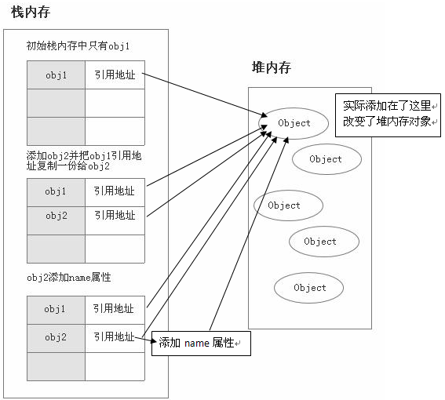

# 第02节：变量与数据类型

### 一、变量的基本概念

变量可以理解为是一个存储数据的容器

代码如下所示:
``` js
var n = 100;
var s = "hello world";
```

如代码所示，我们可以通过var声明一个变量，`var`后面的英文字母就是变量名，变量名是自定义的，在一定的规则下我们可以随意命名（下一部分我们来讲命名规则）。

`=`在编程语言中不是等于的意思，而是赋值的意思，也就是把`=`右侧的数据赋值给左侧的变量；简单的说，就是把“=”右侧的值装到左侧的容器里。

每行结尾的分号并不是必须写的，但是为了代码更加规范，我们要求每行代码的结尾都要写分号，用以表示本行结束（注意必须是英文半角的分号）。

在代码中，第一行的数据没有引号，第二行的数据有引号，为什么存在这样的差异，我们在下一节数据类型中会详细讲解。

### 二、变量的命名规范

代码如下所示:

``` js
var age = 17;
var num1 = 198;
var num2 = 200;
var price = 25.6;
var _name = "小明";
var $fruit = "苹果";
var firstName = "Lily";
var message = "I love javascript";
alert(typeof(message));
```

* 变量名要见名知意
* 变量名可以是字母、下划线、$，还有数字；但是不能以数字开头
* 小写字母开头，多个单词，第二个单词首字母大写（驼峰命名）
* 不可以与关键字、保留字重复


### 三、数据类型

#### 基本数据类型

``` js
    // 数值类型(Number)和布尔类型(Boolean)
    var a = 10;
    var b = a;
        b = 20;
    alert("a="+a);//打印a=10

    var b1 = true;
    var b2 = b1;
        b2 = false;
    alert("b1="+b1);//打印b1=true

``` 


+ 字符串类型(String)
    + 不可变性
+ Null 类型
    + ndefined 是声明了变量但未对其初始化时赋予该变量的值，null 则用于表示尚未存在的对象（typeof 运算符对于 null 值会返回 "Object"。）
+ Undefined 类型
+ Boolean 类型

#### 引用数据类型
``` js
<script type="text/javascript">
    var obj1 = new Object();
    var obj2 = obj1;
    obj2.name = "这是一个属性";
    alert(obj1.name); 
</script>
``` 



### 四、四则运算

在四则运算中，需要特别注意的，乘法在代码中用的是“*”，除法在代码中用的是“/”。我们将运算的结果分别赋值给了四个变量，并在控制台输出,
代码如下所示：

``` js
var num1 = 10 + 20;
var num2 = 10 - 20;
var num3 = 10 * 20;
var num4 = 10 / 20;
console.log(num1);
console.log(num2);
console.log(num3);
console.log(num4);
```

我们可以直接用数字做四则运算，也可以将数字赋值给变量，再对变量进行运算操作，得到的结果和上一个案例相同，
代码如下所示：

``` js
var num1 = 10;
var num2 = 20;
var result1 = num1 + num2;
var result2 = num1 - num2;
var result3 = num1 * num2;
var result4 = num1 / num2;
console.log(result1);
console.log(result2);
console.log(result3);
console.log(result4);
```

### 五、字符串链接

又用到了“+”运算符，但是和之前不同，之前“+”左右两边是数值，可以通过“+”计算数值的结果，这个例子“+”两边是字符串，那么将会将两个字符串连接，然后赋值给str3,
代码如下所示：

``` js
var str1 = "hello";
var str2 = "world";
var str3 = str1 + str2;
console.log(str3)
```

